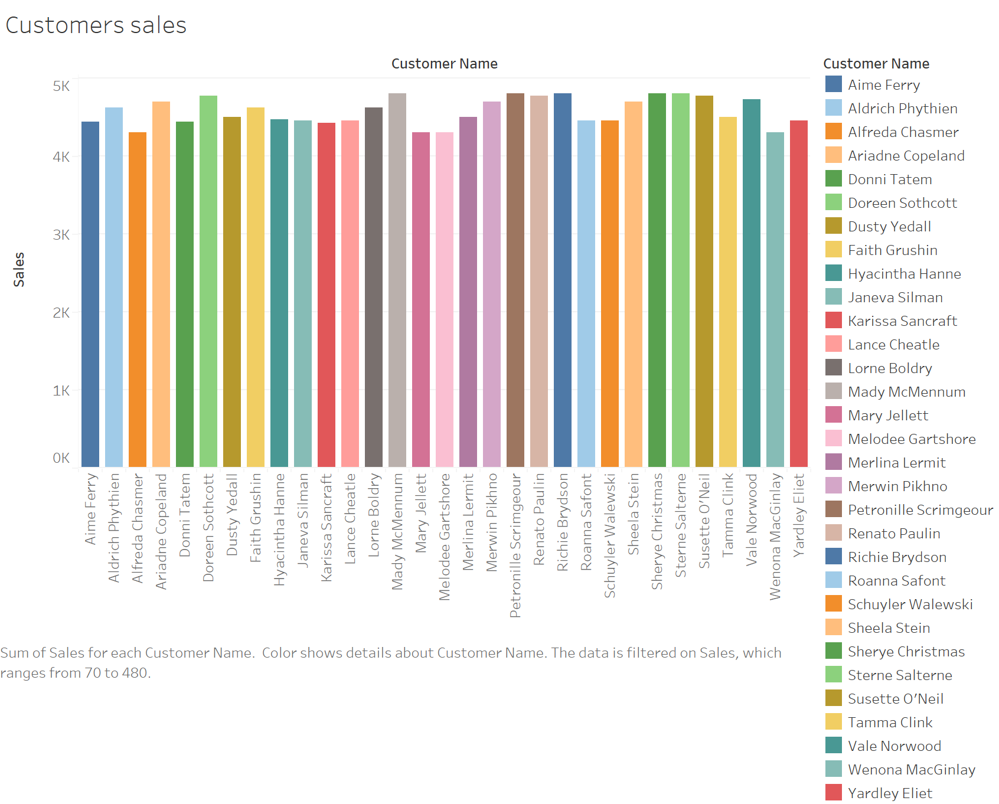

Little Lemon Restaurant
=======================

This is a database for a restaurant.

## Technologies

- MySQL
- Podman (or Docker)
- Python
- Juptyer Notebook
- Tableau

## Pre-requisites

- Podman (or Docker)
- Make

## Installation

1. Clone the repository:
```bash
git clone https://github.com/DavidMiserak/Little-Lemon-DB.git
```

2. Change to the repo directory:
```bash
cd Little-Lemon-DB
```

3. Change to the `little-lemon` directory:
```bash
cd little-lemon
```

4. Start the database:
```bash
make db-start
```

5. Load the database:
```bash
make db-load
```

5. Start the Jupyter Notebook:
```bash
make jupyter-start
```

6. Open the Jupyter Notebook in your browser:
[http://localhost:8888](http://localhost:8888)

7. Open the `little-lemon.ipynb` notebook.

8. Run the notebook.

9. Start Tableau.

10. Connect to the MySQL database:
- Server: `localhost`
- Port: `3306`
- Database: `LittleLemnDB`
- User: `root`
- Password: `123456`

11. Open the `little-lemon.twb` workbook.

12. Enjoy!

## Entity Relationship Diagram


## Customer Sales Dashboard



## Profit Dashboard


## Sales by Customer Dashboard


